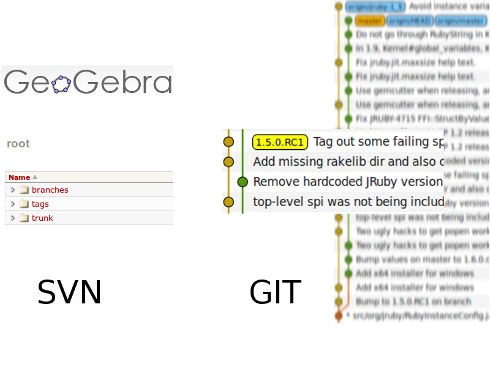

!SLIDE center transition=toss
# Tags #

!SLIDE bullets incremental
# Tags #

* It's just a name for a commit.
* -a for an unsigned tag object.
* -m for the message

!SLIDE commandline incremental
# Tagging our repo #

    $ git tag -a -m "Init..." init f90b
    $ git checkout init
    HEAD is now at f90b86b... Initial commit
    $ git checkout master
    Previous HEAD position was f90b86b... Initial commit
    $ git tag
    init
    $ git show --oneline init
    tag init
    Init...
    f90b86b Initial commit

!SLIDE bullets incremental
# Pulling and pushing tags #

* Most tags are pulled by default.
* Use --tags with pull if needed.
* Use --tags option to push tags.
