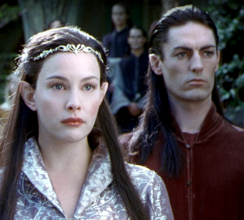
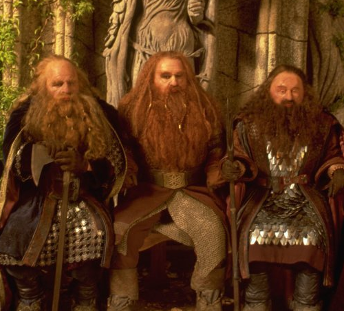
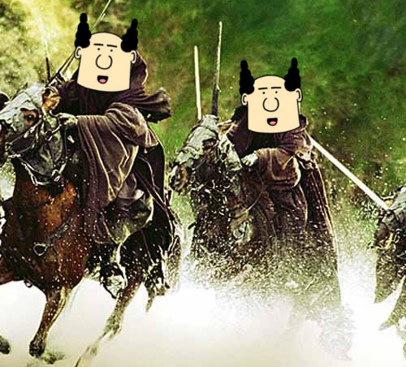
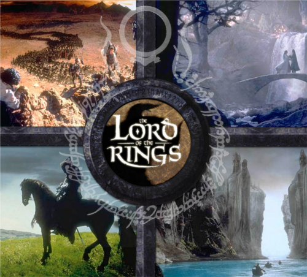

!SLIDE 
# Introducción a Git #

!SLIDE left bullets incremental

# Do you all know... #

* ...what is a SCM (Software Configuration Manager)?
* ...what is a CVS (Concurrent Versions System)?
* ...what is the difference?

!SLIDE transition=scrollUp

# Shall we continue? #

!SLIDE center transition=scrollUp

# CVS #

!SLIDE center transition=fade

# SVN #

!SLIDE center

# Elves #

!SLIDE center

# Dwarves #

!SLIDE center

# Mortal men #

!SLIDE center

# Testers #

!SLIDE center

# Code monkeys #

!SLIDE center

# Pointy-haired bosses #

!SLIDE center

# Elves #

!SLIDE center

# Dwarves #

!SLIDE center

# Mortal men #

!SLIDE center

# GIT #

