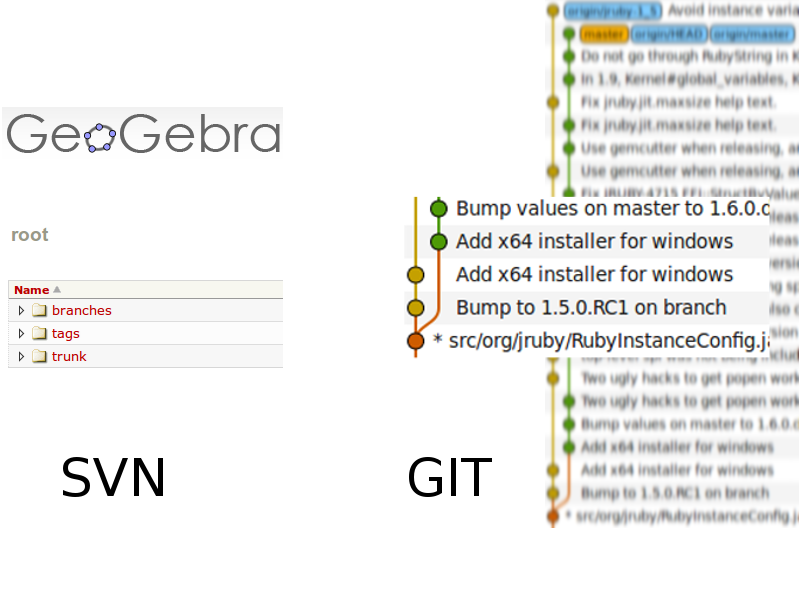

!SLIDE bullets incremental center transition=scrollRight
# Branches in SVN #

!SLIDE commandline incremental
# Branches in git #

    $ git branch
    * master

    $ git checkout -b show_me_the_money
    Switched to a new branch 'show_me_the_money'

    $ git branch
      master
    * show_me_the_money

    $ git checkout master
    Switched to branch 'master'

    $ git branch
    * master
      show_me_the_money

!SLIDE bullets incremental
# More about branches #

* Default branch: master (convention)
* -d: delete branch, if fully merged in HEAD.
* -D: delete branch.
* -r: list remote branches.

!SLIDE commandline incremental
# Working a bit with branches #

    $ echo 'echo "the money"' > show_me
    $ chmod a+x show_me
    $ ./show_me
    the money
    $ git add show_me
    $ git commit -m "Show me the money"
    [show_me_the_money bcc25ff] Show me the money
     1 files changed, 1 insertions(+), 0 deletions(-)
     create mode 100755 show_me
    $ git diff --shortstat master show_me_the_money
     1 files changed, 1 insertions(+), 0 deletions(-)

!SLIDE commandline incremental
# Simple merging #

    $ git checkout master
    Switched to branch 'master'

    $ git merge show_me_the_money 
    Updating f78d882..bcc25ff
    Fast forward
     show_me |    1 +
     1 files changed, 1 insertions(+), 0 deletions(-)
     create mode 100755 show_me

    $ git branch -d show_me_the_money 
    Deleted branch show_me_the_money (was bcc25ff).

!SLIDE bullets incremental
# What about conflicts? #

* <<<<<<< _starts_ the conflict
* ======= _separates_ different versions
* &gt;&gt;&gt;&gt;&gt;&gt;&gt; _ends_ the conflict
* _git reset --hard HEAD_ if too many conflicts
